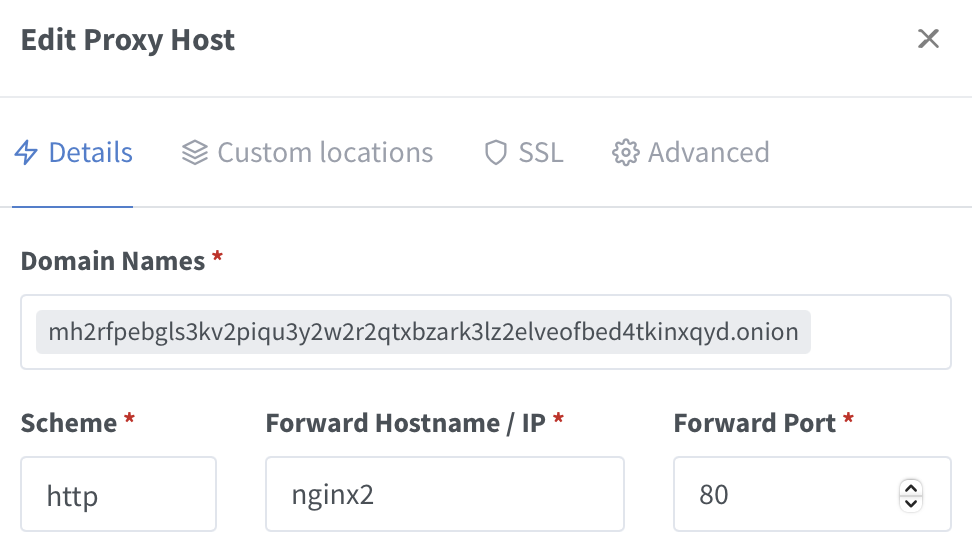
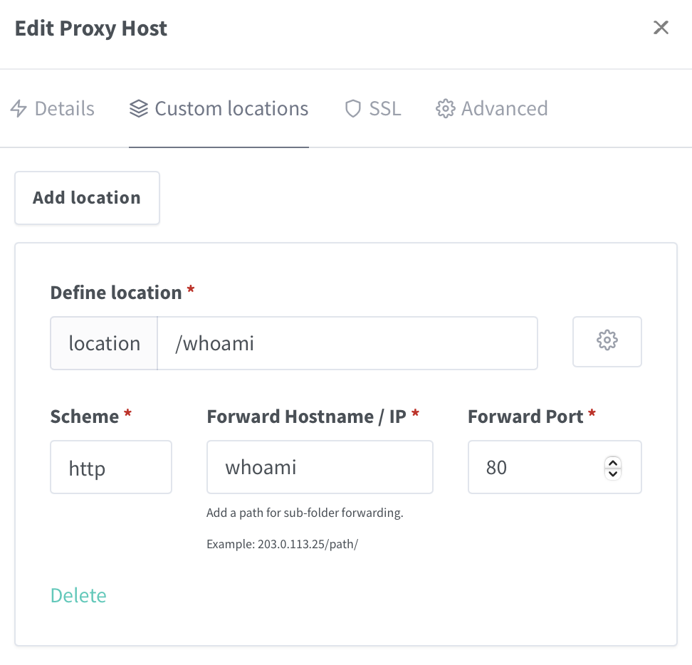

# hidden-service

[](https://codespaces.new/SimonHaas/hidden-service?quickstart=1)

Quickly host and access your very own `.onion` website.

Powered by [https://github.com/cmehay/docker-tor-hidden-service](https://github.com/cmehay/docker-tor-hidden-service)

``` shell
docker compose up -d

# Wait until: Bootstrapped 100%: Done
docker compose logs -f tor

# Get the address of your .onion site
docker compose exec tor onions

# You can see the keys of your site inside the tor container
docker compose exec tor ls -la /var/lib/tor/hidden_service
```

1. open your browser
2. set the SOCKS proxy to `localhost:9050`
3. browse to your own `.onion` website 🧅🚀

If you do not want to change settings in your browser, you can use [webtop](https://github.com/SimonHaas/webspace) on port 3000 to open a remote instance of firefox.
In this case, set the SOCKS proxy to `torproxy:9050`.

Just like on the clear web you can use multiple services via different ports on the same address.
You can also host multiple hostnames eg. multiple .onion-addresses.

## vanity addresses

https://community.torproject.org/onion-services/advanced/vanity-addresses/

The time to generate vanity address increases exponentially with the length of your filter.

`docker run --rm -it -u 1000:1000 -v ./vanity:/vanity ghcr.io/cathugger/mkp224o:master -v -s -n 1 -d /vanity test`
- verbose output
- print statistics
- generate one address
- put it in a directory called `../vanity`
- let the address start with `test`

A short benchmark on a Github Codespace with 2-cores and 8GB RAM:

``` shell
time docker run --rm -it -u 1000:1000 -v ./vanity:/vanity ghcr.io/cathugger/mkp224o:master -v -s -n 1 -d /vanity test
real    0m0.461s
user    0m0.004s
sys     0m0.019s

time docker run --rm -it -u 1000:1000 -v ./vanity:/vanity ghcr.io/cathugger/mkp224o:master -v -s -n 1 -d /vanity testa
real    0m14.071s
user    0m0.001s
sys     0m0.020s

time docker run --rm -it -u 1000:1000 -v ./vanity:/vanity ghcr.io/cathugger/mkp224o:master -v -s -n 1 -d /vanity testab
real    8m47.063s
user    0m0.018s
sys     0m0.016s
```

To use a generated vanity address, base64-encode `base64 vanity/testqbiav67za3ys3w43ed2dkluyaivu2fkoqkjuz6g2tecqtjjjgiqd.onion/hs_ed25519_secret_key` the private key and add it as an environment variable to the tor container in docker-compose.yaml.

To not leak the private key in your docker-compose file, create an environment variable:

``` shell
export SERVICE1_TOR_SERVICE_KEY="$(base64 vanity/testqbiav67za3ys3w43ed2dkluyaivu2fkoqkjuz6g2tecqtjjjgiqd.onion/hs_ed25519_secret_key)"

# verify
echo $SERVICE1_TOR_SERVICE_KEY
```

Inside `docker-compose.yaml`:

``` yaml
services:
  tor:
    environment:
        # tor v3 address private key base 64 encoded for hostname testqbiav67za3ys3w43ed2dkluyaivu2fkoqkjuz6g2tecqtjjjgiqd.onion:80
        SERVICE1_TOR_SERVICE_KEY: |
            PT0gZWQyNTUxOXYxLXNlY3JldDogdHlwZTAgPT0AAACQcfhGqBnUab0I9CNgOiHaVPsSr+cB0P7V
            t3K6/qMAZ+pAwEPVmkLJFLgOK92l9qyQHRRKcge8Ple7E0UyIybm
        # or if you have created an environment variable, simply omit the value
        SERVICE1_TOR_SERVICE_KEY:
```

# nginx-proxy-manager

I have added [nginx-proxy-manager](https://nginxproxymanager.com) just to show and explore a different use case.
You can access the admin interface on `localhost:81` and login with username `admin@example.com` and password `changeme`.
It does not make sense to add multiple proxy hosts but you can add one, the onion-domain of your nginx-proxy-manager instance.



Then you can use custom locations to host multiple services under one port.


